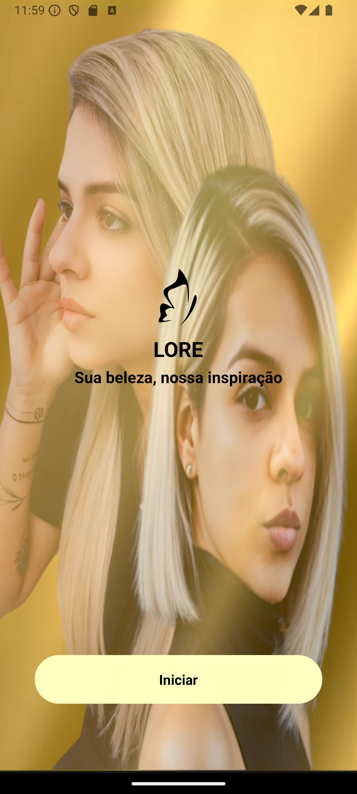
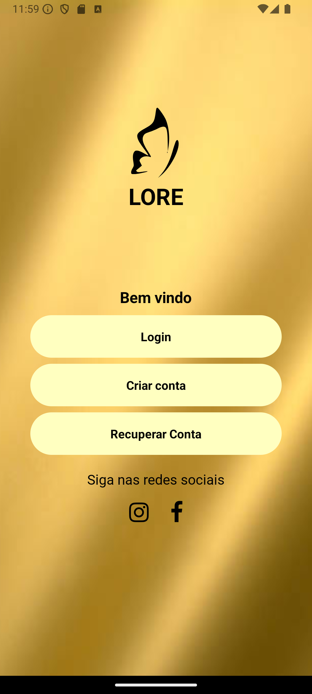
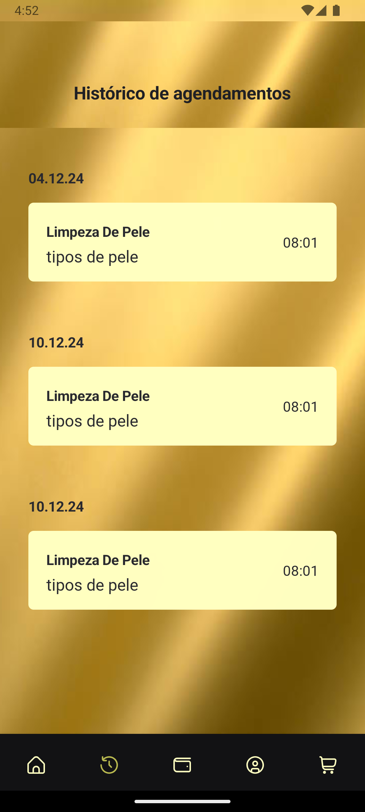
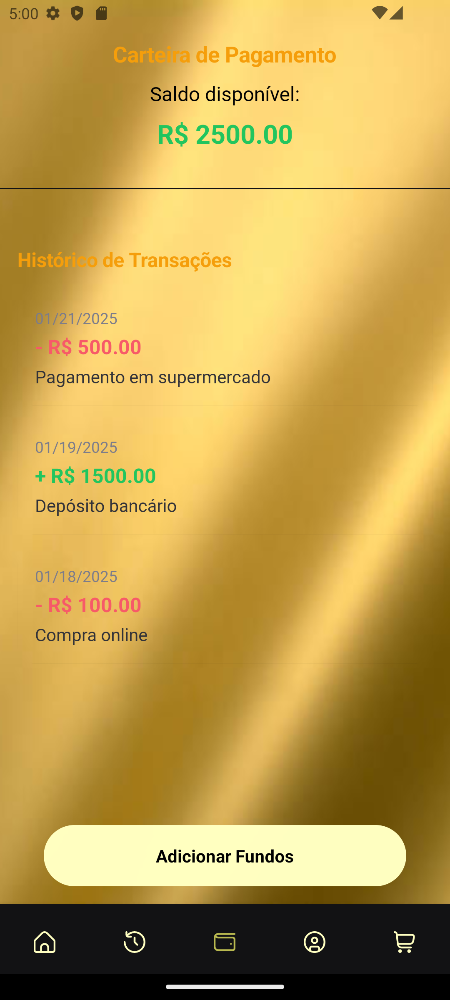

## 💻 Projeto

# Espaço Estética

[](https://github.com/rodrigo-teixeira-silva/espaco_beleza/blob/main/src/LICENCE)

# Sobre o projeto

 **</>Code link Project**.

A Espaço Estética é uma aplicação mobile projetada para atender clínicas de estética e centros de beleza, proporcionando uma experiência digital prática e moderna para clientes e profissionais. A plataforma permite a apresentação de pacotes de serviços, planos personalizados e a venda de produtos relacionados ao bem-estar e cuidados pessoais.

Catálogo de Pacotes e Planos:Exibição detalhada de pacotes de serviços estéticos, com descrições e preços 

Venda de Produtos: Loja integrada para comercialização de cosméticos, suplementos e acessórios de beleza. Os clientes podem navegar pelo catálogo, adicionar produtos ao carrinho e finalizar suas compras diretamente pelo aplicativo.

Agendamentos:Organização de sessões estéticas, permitindo ao usuário escolher o melhor horário e pacote conforme suas preferências e disponibilidade.

Métodos de Pagamento Modernos:O aplicativo oferece opções seguras e convenientes de pagamento, incluindo:

QR Code: pagamento instantâneo via Pix
Cartão de Crédito/Débito: compatível com as principais 

A Espaço Estética transforma a jornada do cliente em uma experiência digital fluida, prática e eficiente, elevando o padrão de serviços oferecidos no segmento de estética e beleza.

## Layout mobile

| **Tela de splash** | **Tela de início** | **Tela de bem vindo** |
| :-------------------------------------------: | :------------------: | :------------------------------------------: |
|  |  |  |

|**Tela de home** | **Tela de histórico** | **Tela de carteira** |
| :---------------------------: | :-------------------: | :----------------: |  
|  |  |  | 

|**Tela de perfil** | **Tela de carrinho<br> de compras** | ** Tela de produtos **
| :--------------------------:| :-------------------------------: | :-------------------------------: |
|  | |  | 

# Tecnologias utilizadas

- [@expo-google-fonts/roboto](https://www.npmjs.com/package/@expo-google-fonts/roboto) - ^0.2.3  
- [@gluestack-style/react](https://www.npmjs.com/package/@gluestack-style/react) - ^1.0.57  
- [@gluestack-ui/config](https://www.npmjs.com/package/@gluestack-ui/config) - ^1.1.20  
- [@gluestack-ui/themed](https://www.npmjs.com/package/@gluestack-ui/themed) - ^1.1.65  
- [@hookform/resolvers](https://www.npmjs.com/package/@hookform/resolvers) - ^3.9.1  
- [@react-native-async-storage/async-storage](https://www.npmjs.com/package/@react-native-async-storage/async-storage) - 1.23.1  
- [@react-native-community/masked-view](https://www.npmjs.com/package/@react-native-community/masked-view) - ^0.1.11  
- [@react-navigation/bottom-tabs](https://www.npmjs.com/package/@react-navigation/bottom-tabs) - ^7.1.2  
- [@react-navigation/drawer](https://www.npmjs.com/package/@react-navigation/drawer) - ^7.1.1  
- [@react-navigation/native](https://www.npmjs.com/package/@react-navigation/native) - ^7.0.9  
- [@react-navigation/native-stack](https://www.npmjs.com/package/@react-navigation/native-stack) - ^7.1.10  
- [axios](https://www.npmjs.com/package/axios) - ^1.7.9  
- [expo](https://www.npmjs.com/package/expo) - ~52.0.14  
- [expo-barcode-scanner](https://www.npmjs.com/package/expo-barcode-scanner) - ^13.0.1  
- [expo-camera](https://www.npmjs.com/package/expo-camera) - ~16.0.16  
- [expo-file-system](https://www.npmjs.com/package/expo-file-system) - ~18.0.6  
- [expo-font](https://www.npmjs.com/package/expo-font) - ~13.0.1  
- [expo-image-picker](https://www.npmjs.com/package/expo-image-picker) - ~16.0.6  
- [expo-status-bar](https://www.npmjs.com/package/expo-status-bar) - ~2.0.0  
- [lucide-react-native](https://www.npmjs.com/package/lucide-react-native) - ^0.462.0  
- [react](https://www.npmjs.com/package/react) - 18.3.1  
- [react-hook-form](https://www.npmjs.com/package/react-hook-form) - ^7.54.2  
- [react-native](https://www.npmjs.com/package/react-native) - ^0.76.3  
- [react-native-gesture-handler](https://www.npmjs.com/package/react-native-gesture-handler) - ~2.20.2  
- [react-native-get-random-values](https://www.npmjs.com/package/react-native-get-random-values) - ^1.11.0  
- [react-native-reanimated](https://www.npmjs.com/package/react-native-reanimated) - ~3.16.1  
- [react-native-safe-area-context](https://www.npmjs.com/package/react-native-safe-area-context) - ^4.14.1  
- [react-native-screens](https://www.npmjs.com/package/react-native-screens) - ~4.1.0  
- [react-native-svg](https://www.npmjs.com/package/react-native-svg) - 15.8.0  
- [react-native-vector-icons](https://www.npmjs.com/package/react-native-vector-icons) - ^10.2.0  
- [yup](https://www.npmjs.com/package/yup) - ^1.6.1  


# Funcionalidades do projeto

- [x] Tela Tela inicial
- [x] Tela Start 
- [x] Tela Bem vindo
- [x] Tela Home
- [x] Tela de produtos 
- [x] Tela de histórico
- [x] Perfil
- [x] Carteira
- [x] carrinho


# Como executar o projeto

## clonar repositório

```bash
git clone git@github.com:rodrigo-teixeira-silva/espaco_beleza.git

```
## Instalar o npm 

```bash
# cd Espaco_Beleza/mobile
npm install
```

```bash
# cd Espaco Beleza
npm install
```
# Rodar a api 

```bash
# rodar a api
npm start 

ou

# para que as alterações sejam atualizadas em tempo real
npm run dev 
```


# Executar o projeto


```
# cd espaco_beleza
npx expo run:android
```

```
## Aplicação Mobile
Pré-requisitos: npm 

```
# Autor

## Rodrigo Teixeira Silva


## Contatos

[](https://github.com/rodrigo-teixeira-silva)
[](https://www.linkedin.com/in/rodrigo-teixeira-silva/)

